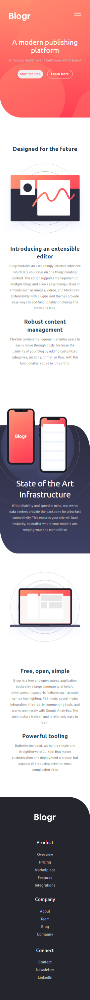

# Frontend Mentor - Blogr landing page solution

This is a solution to the [Blogr landing page challenge on Frontend Mentor](https://www.frontendmentor.io/challenges/blogr-landing-page-EX2RLAApP). Frontend Mentor challenges help you improve your coding skills by building realistic projects. 

## Table of contents

- [Overview](#overview)
  - [The challenge](#the-challenge)
  - [Screenshot](#screenshot)
  - [Links](#links)
- [My process](#my-process)
  - [Built with](#built-with)
 
- [Author](#author)

## Overview

### The challenge

Users should be able to:

- View the optimal layout for the site depending on their device's screen size
- See hover states for all interactive elements on the page

### Screenshot

#### Desktop-view

#### Mobile-view
### Links

- Solution URL: [blogr-landing-page](https://github.com/ezekiel673/blogr-landing-page)
- Live Site URL: [blogr-landing-page Live site URL](https://ezekiel673.github.io/blogr-landing-page/)

## My process

### Built with

- Semantic HTML5 markup
- CSS custom properties
- Flexbox

## Author

- Frontend Mentor - [@Ezekiel-Great](https://www.frontendmentor.io/profile/Ezekiel-Great)
- Twitter - [@yeshua_codeit](https://www.twitter.com/yeshua_codeit )
